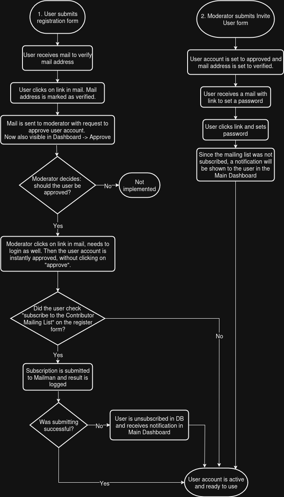
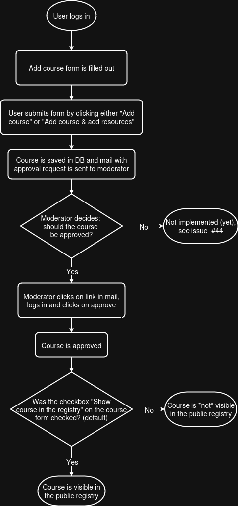
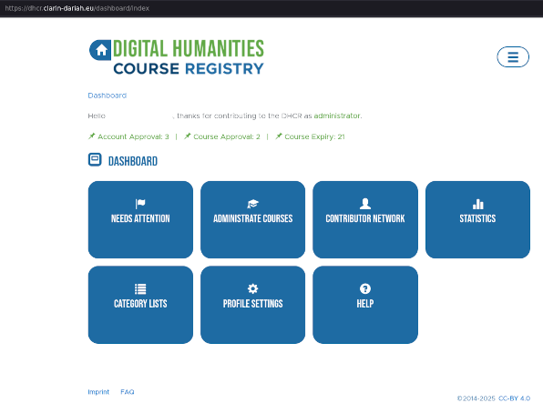
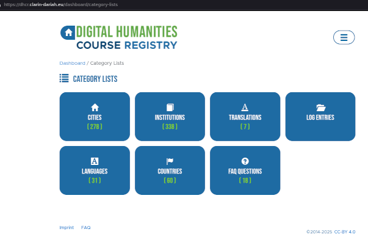

# DHCR Technical Documentation

## Introduction
The Digital Humanities Course Registry (DHCR) web application exists since 2014 and provides an up-to-date and curated overview of courses
in the area of Digital Humanities, in Europe and beyond.  
It is a responsive web application, which can be viewed on laptop, tablet and smartphone.

Courses can be divided in two categories:
- *Activities* (event with start and end date and a location)
- *Digital objects* (like training materials available online)

The DHCR is there to register and present the *Activities*. 
The *Digital objects* can be registered in DARIAH Campus.

The curation process includes:
- Approval of new user accounts
- Approval of new courses
- Automated hiding of outdated courses, showing only recent updated courses
- Sending email reminders about outdated courses

## Relevant resources

### Web application
https://dhcr.clarin-dariah.eu/

### API
https://dhcr.clarin-dariah.eu/api/v2/

### API Documentation
https://app.swaggerhub.com/apis-docs/hashmich/DHCR-API

### Release notes
#### Latest (dev branche)
[RELEASE_NOTES.md](RELEASE_NOTES.md)
#### Production
https://github.com/acdh-oeaw/dhcr-main/blob/prod/documentation/RELEASE_NOTES.md

### GitHub issues
https://github.com/acdh-oeaw/dhcr-main/issues

## User roles, access & processes

### Non-login user
Everybody can view all courses as well as the course details, without an account or login.

### Course contibutor
To enter a new course or maintain course data, it's required to create an account. The default role
is course contributor. The user account has to be approved first, before it can be used.

#### Course contributors are responsible for:
- Entering own courses and keeping this information up-to-date (reminder emails are sent)

#### Course contributors can:
- Enter new courses
- View outdated and all own courses
- Update / edit own existing courses
- Unpublish own courses (f.e. in case they don't take place anymore)
- Change profile settings:
    - Email address
    - Paswword
    - (Un)subscribe to the mailing list
    - Edit profile: title, first name, last name
    - View dedicated Course Contributors FAQ

#### User Registation Process
##### Option 1
https://dhcr.clarin-dariah.eu/users/register
##### Option 2
Dashboard / Contributor Network / Invite User 
https://dhcr.clarin-dariah.eu/users/invite

### National Moderator
The user account can be "upgraded" to National Moderator by changing the user role. This can be done by the Administrator. National moderators are responsible for the curation of a specific country. This country is based on the location of the institution the user is associated with. One National Moderator can moderate only one country.
For most countries a national moderator is available. In case there isn't, an administrator need to take over.

#### National Moderators are, in their country, responsible for:
- Approval of new user accounts
- Approval of new courses
- Contacting Course Contributors when courses are outdated for a long time (reminder emails are sent)
- Maintaining Master Data for Cities
- Maintaining Master Data for Institutions
- Periodically reviewing the course data

#### National Moderators can:
- The same as Course Contributors, and also specific in their country:
    - Approve new user accounts
    - Approve new courses
    - Invite new users (shorter process & custom language, all countries)
    - View pending invitations
    - View outdated and all courses
    - Update / edit courses
    - View and edit users
    - View, add, edit Master Data for Cities
    - View, add, edit Master Data for Institutions
    - View dedicated National Moderators FAQ
    - View DHCR process explanation: "Users, Access and Workflows" (predecessor of this document)

#### Course Entry Process

### Administrator
Administrator is the "highest" role in the application and has access to everything.

#### Administrators are responsible for:
- National Moderator tasks in countries where no moderator is available
- Assigning National Moderators to a country
- Maintain the public list of National Moderators https://dhcr.clarin-dariah.eu/national-moderators
- Maintain the FAQs for: public, course contributor, national moderator

#### Administrators can:
- The same as National Moderators and also:
    - All National Moderator tasks, for all countries
    - View all external resouces added to courses
    - View, edit all moderators (special list)
    - Maintain Master Data for:
        - Countries
        - Languages (of a course)
        - Translations of user invitations
    - Maintain the 3 types of FAQ's, for:
        - Public
        - Course contributor
        - National moderator
    - View application log
    - View statistics and app info (used software versions)

#### Admin Main Dashboard

[Large image](`images/admin_main_dashboard-large.png)`)

#### Admin Category Lists

[Large image](`images/admin_category_lists-large.png)`)

## Courses

### Course curation
TODO:
- Expiration times
- Reminders
- Flow chart

## Data model for course and related entities

## Extra features

### User invitation and translated message

### Public moderator list

### FAQ's

### Review reminders

### Log entries
- Log codes

## Development process

### Instances
- 3 instances

### Github Issues

#### Labels
#### Workflow

### Cron jobs

### Jobs executed on deployment

### Used technologies
